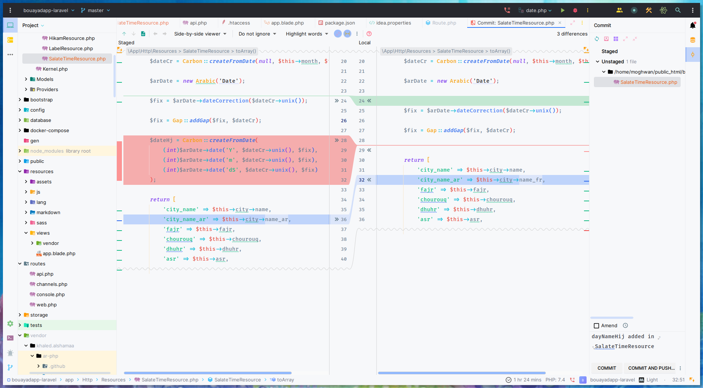

  
	<h1>Early Riser Syntax</h1>
	

		<b>A light syntax theme for Php/WebStorm</b>
	

	 
	 

Early Riser is a light syntax theme for JetBrains' IDEs for all you early risers out there, ported and enhanced from the awesome original color scheme [Early Riser Syntax for VS Code](https://github.com/mikemcbride/vscode-early-riser) by [Mike McBride](https://github.com/mikemcbride/).

## Screenshots

## Installation

In PhpStorm/WebStorm, go to `Settings > Editor > Color Scheme` press the little cog next to the scheme selector, and choose `Import Scheme`.

## Credits

- Heavily inspired/based by [Mike McBride](https://github.com/mikemcbride/)'s [VSCode theme](https://github.com/mikemcbride/vscode-early-riser)
- Icon design by [David Leininger](https://twitter.com/davidleininger)

## Contributing

This theme is still a work in progress. Feel free to send PRs and open issues.

## LICENSE

[MIT](./LICENSE)
